<h3>Video games flow CCOM UPRRP</h3>
<h1> to get into the flow of of a true videogame programmer, we submitted some songs to the official class Spotify playlist.</h1>

For Gabriel's submission, La vaguelette from Genshin Impact, and Sealed Vessel from Hollow Knight

For Janiel's submission, The Hub from ENA Dream BBQ, and Velmas Viru Gate from World of Dweebs

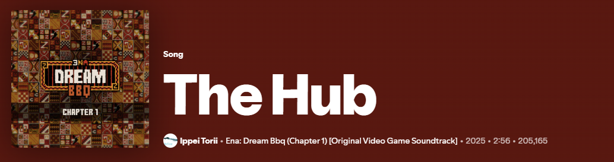

<h3>Action Matrix</h3>

Below is the complete action matrix for the player character

| Action                  | Mappings  |
| :-------                | :-------- |
| Horizontal movement     | A and D keys, Left and Right arrows |
| Vertical movement       | W and S keys, Up and Down arrows  |
| Shoot                   | Left Click Mouse  |
| Jump                    | Space Bar  |
| Look                    | Mouse  |
| Fast horizontal movement| Hold Shift and A and D keys, Left and Right arrows |
| Fast vertical movement  | Hold Shift and W and S keys, Up and Down arrows  |

<h3> C# Script </h3>

Basing ourselves from the existing code written during the class, we used the pre-defined functrions in the player input map within unity to give them the proper code for them to function.

Below is a quick look at the variables which we will bemaking reference to:

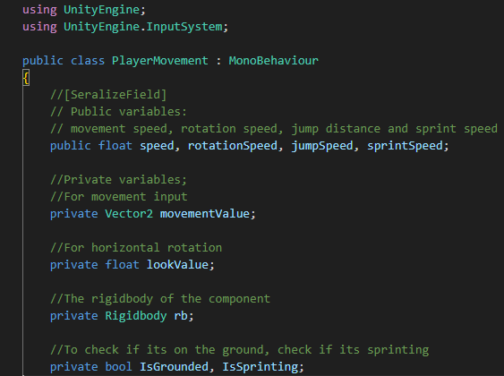
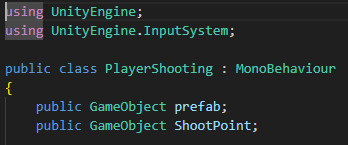

<h1>Horizontal and vertical movement</h1>

For the non-y movement, we utilized the OnMove function

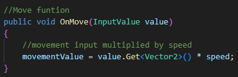

we took the uneditable private function movementValue and multiplied it by the speed we set and the player's position vector

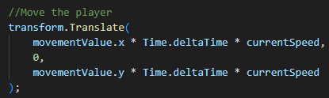

Then we multiplied the variable with Time.deltaTime to make sure the movement speed is the same machines of all speeds, and then with the current non-sprinting speed of the player. We did this for the X and Z positions.

We will address the cirrentSpeed variable in a future section.

<h1>Shoot</h1>

The data for this is in a different script.

Using the OnFire function, when the player hits the fire button, the game generates a clone of the bullet and spawns it on an invisible empty known as ShootPoint, giving it its rotation and position. Once spawned, the bullet shoots forward for a set amount of time, then despawns.

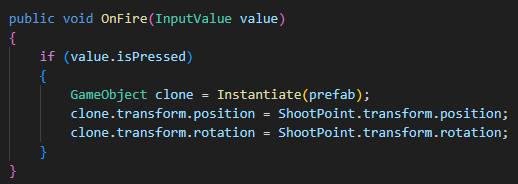

<h1>Jump</h1>

First, we make the Grounded function to see if the player is on the ground or not. Grounded is called per frame within Update().

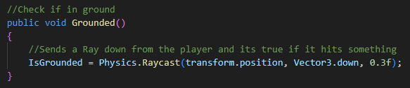

It shoots a ray below the player and, if it hits something, it will return true and will mean the player is grounded.

After, we used the OnJump function, making sure the button is pressed and the player is grounded, and give an upward force (a jump) to the player if these are true.

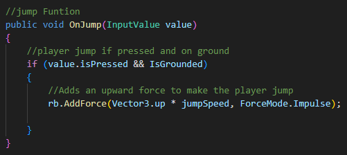

<h1>Look</h1>

For looking, we created a private float variable called lookValue, using it with a public float rotationSpeed variable.

Using the OnLook function, we give look value the value of the player's x vector times the rotation speed.

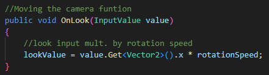

After that, we perform a transform.Rotate, similar to the Translate we performed for the player's movement, but the rotate allows the player to rotate based on the mouse's movement. Only ont he Y axis.

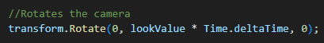

<h1>Fast horizontal and vertical movement (sprint)</h1>

It was tricky making the player sprint, but we were able to figure it out.

First, using the OnSprint function, we make sure to update isSprinting to if the sprint button is pressed or not.

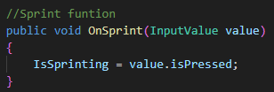

Then, in the update function, we update grounded over and over, then verify if the player is currently pressing Shift ont heir keyboard.

If so, as a form of assurance, the isSprinting variable is set again.

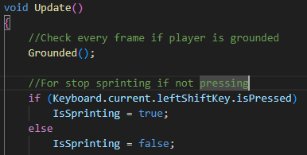

finally, if the player has the key pressed (intends to sprint), the variable currentSpeed will become the intended sprinting speed. If not, the variable is simply the walking speed. These then go to the normal player movement functions to make it move at sprint speed or at walk speed, you can see a glipse of this in a previous section.

<h2>Put all that together and you get:</h2>

